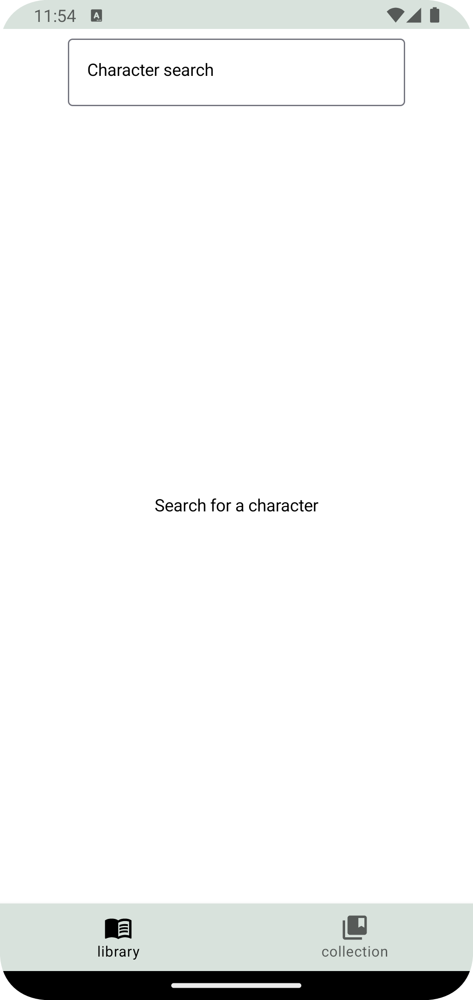
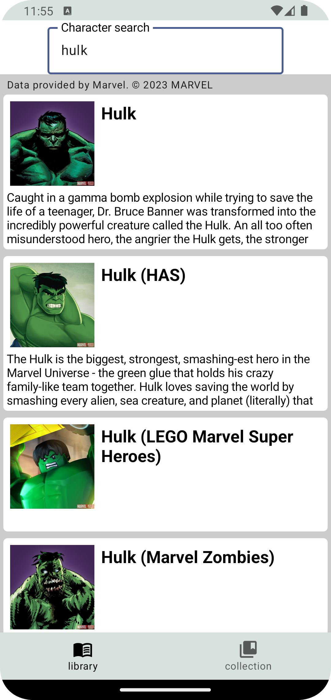
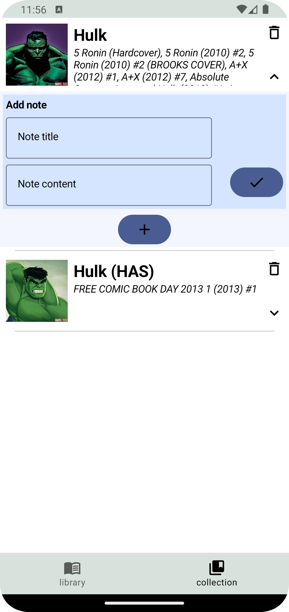
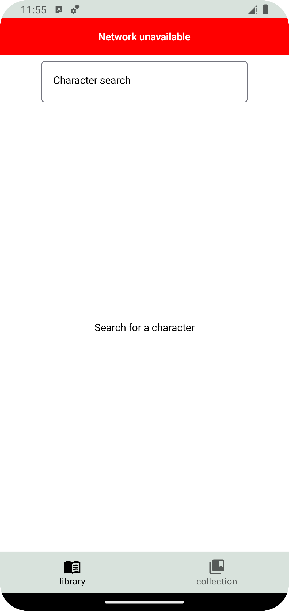

# Comics App with Jetpack Compose

this program uses [Marvel](https://developer.marvel.com/) Api

the technologies used in this project consist of:

1.kotlin

2.Jetpack compose 

3.Hilt

4.Coroutines and Flow 

5.Retrofit

6.RoomDb

7.MVVM

8.Navigation

## Description

When learning to build an Android application, you start by learning the basics and then move to learn the libraries used in Android development. But you rarely learn the correct way to use these libraries together, to make a consistent, well designed and well developed application. This is where this course comes in.

Here we use the latest tools and techniques to build an app that is scalable and maintainable, to the latest standards in Android development.

After taking this course, you will know how to build a new app from scratch, in a way that you can later expand and improve without compromising on architecture.

We will use many of the most common libraries and tools in use today in Android development.

## Demo

 

 

